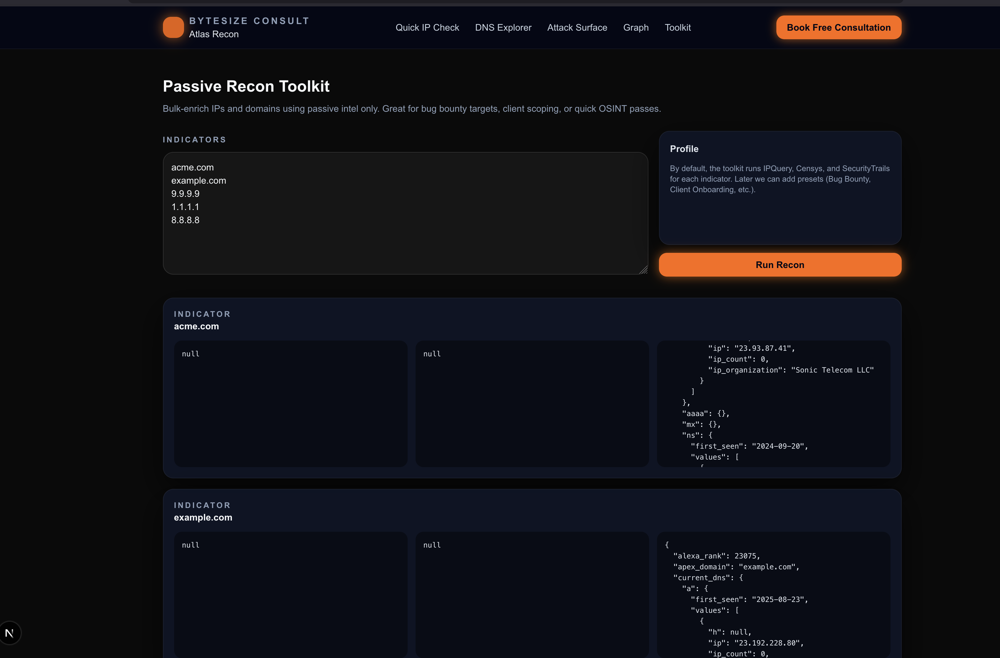

# 🛰️ Bytesize Atlas  
### Open-Source Reconnaissance, Attack Surface Mapping & Analyst Intelligence Platform  
*By Bytesize Consult*

Bytesize Atlas is a lightweight, modern, and extensible threat intelligence toolkit built for:

- Security researchers  
- SOC analysts  
- Bug bounty hunters  
- Red teamers  
- IT consulting teams  
- OSINT investigators  

The platform combines **IP enrichment**, **DNS discovery**, **passive recon**, and a **3D attack-surface graph** with community/analyst-driven **assertions**, labeling, and knowledge-building.

---

## 🚀 Current Status (MVP)

As of **v0.1.0 (MVP)** the following features are live and working:

### ✔ Quick IP Check
- Enrichment via **IPQuery**, **Censys**, and **SecurityTrails**
- Shows ASN, ISP, GeoIP, Risk Score
- Lists open ports & services (Censys)
- Shows DNS + subdomains (ST)

### ✔ DNS Explorer (stub live)
- Routes & UI ready  
- Awaiting production DNS pipeline  
- Resolves targets into A/AAAA/CNAME/MX/etc (mock data for now)

### ✔ Deep-Dive Recon (stub live)
- Simulated Censys + ST + IPQuery bundle  
- Prepares the way for full Attack Surface Explorer  
- Has risk suggestions, exposed ports, service info

### ✔ Assertions / Notes System (Live!)
- Click a node in the 3D graph → open sidebar panel  
- Add structured intel:
  - `owner`
  - `environment` (prod/dev/stage/test)
  - `risk`
  - `category`
  - `note`
- Each assertion stores:
  - Source type (user/system/trusted-org)
  - Confidence score
  - Verification status
- Perfect for building a **knowledge graph** over time

### ✔ 3D Attack Surface Graph (Live!)
- Interactive, draggable, rotatable 3D network map  
- Nodes: IP, domain, subdomain, ASN  
- Relationships: resolves_to / same_asn / manual  
- Sidebar persists reliably  
- Alerts panel for node-level intel

---

## 🧠 Architecture (High-Level)

src/
├─ app/
│ ├─ recon/
│ │ ├─ quick-check/
│ │ ├─ dns-explorer/
│ │ └─ deep-dive/
│ ├─ graph/ ← 3D attack-surface viewer
│ ├─ toolkit/ ← future tools
│ └─ api/
│ ├─ enrich/ ← IPQuery + ST + Censys enrichment API
│ ├─ dns/ ← DNS explorer stub
│ ├─ deep-dive ← bundled recon stub
│ └─ graph/
│ ├─ route.ts ← returns full graph JSON
│ └─ assertions/ ← add analyst labels/notes
│ └─ route.ts
├─ lib/
│ └─ graphStore.ts ← in-memory graph DB (MVP)
└─ components/
└─ ui/ ← shadcn components


---

## 🏗️ Tech Stack

**Frontend**
- Next.js 14 / App Router  
- React 18  
- TailwindCSS  
- shadcn/ui  
- react-force-graph-3d (Three.js under the hood)

**Backend**
- Next.js API routes  
- In-memory graphStore (MVP) → future: Prisma + SQLite/Postgres  
- API integrations:
  - IPQuery
  - SecurityTrails
  - Censys Search

**Architecture**
- Modular recon pipeline  
- Extensible graph engine  
- Assertion-based knowledge model  
- Clean UI kit for enterprise-grade tooling

---

# 📸 Screenshots

### 🏠 Analysis Panel


### 🔍 Quick IP Check


### 🌐 DNS Explorer


### 🧪 Attack Surface Explorer


### 🛰️ Passive Recon


---

## 🛣️ Roadmap (v0.2 → v1.0)

### **v0.2 — Data Model Upgrade**
- Move from in-memory `graphStore.ts` → SQLite/Prisma  
- Persist nodes, links, assertions

### **v0.3 — Recon Pipelines**
- Real DNS resolution (A/AAAA/CNAME/MX/TXT/SOA)  
- Integrate Censys Search v2 host API fully  
- Subdomain harvesting  
- Passively identify tech stacks (HTTP/Fingerprint data)

### **v0.4 — Attack Surface Explorer**
- Auto-generate graph nodes from recon results  
- Relationship engine:
  - resolves_to  
  - same_asn  
  - same_org (ST org data)  
  - same_cidr  
- Risk scoring per asset

### **v0.5 — User System**
- Login/register  
- Org membership (Bytesize, clients, testers)  
- Verified vs unverified assertions  
- Trust/credibility scores

### **v0.6 — Collaboration**
- Comments on nodes  
- References + link sharing  
- Activity log (who added what)

### **v0.7 — Export & Reporting**
- Export graph → PNG / JSON  
- Auto-report generator (PDF/HTML)  
- Recon summary templates

### **v1.0 — Production Release**
- Full recon suite  
- Polished UI/UX  
- Multi-org support  
- API tokens  
- Private hosted deployment (Docker)

---

## 🧪 Local Development

```bash
git clone https://github.com/YOURNAME/bytesize-atlas
cd bytesize-atlas
npm install
npm run dev


